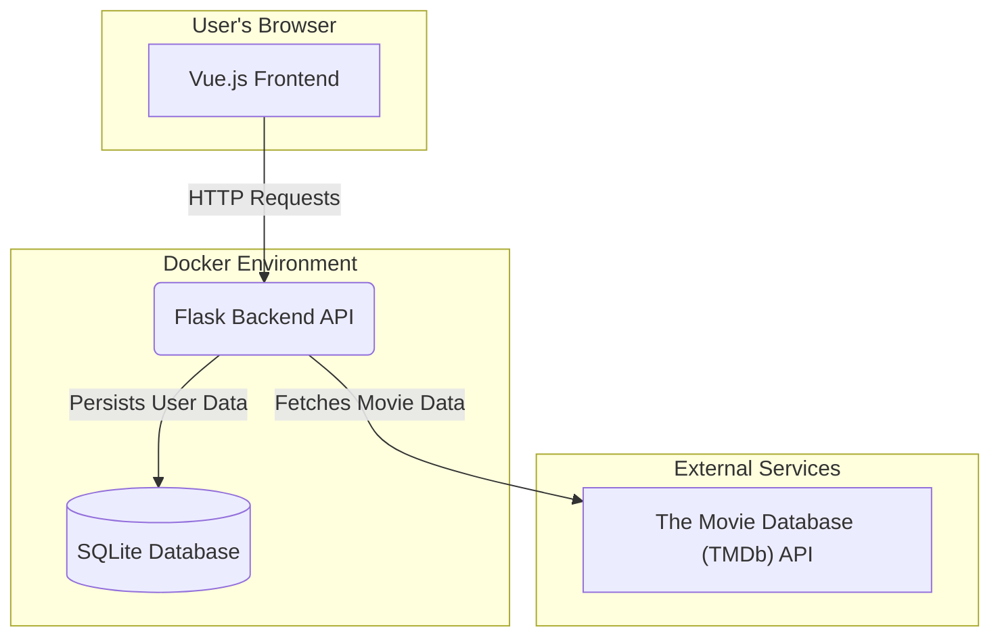

# Pick-A-Flick 🎬

**Discover new movies based on plot descriptions, not the movie poster.** Pick-A-Flick is a Tinder-like movie discovery app that challenges you to judge a film by its plot alone. Swipe through descriptions, and if you like what you read, the movie's title and poster are revealed!

---

## ✨ Key Features

-   **Synopsis-First Swiping**: Decide if you're interested in a movie based solely on its description.
-   **The Big Reveal**: Swiping right reveals the movie's title and poster image.
-   **Genre Filtering**: Choose your favorite genres to get a curated stack of movies.
-   **Personal Watchlist**: Liked movies are automatically saved to your user profile for later viewing.
-   **User Authentication**: Secure registration and login system to manage user profiles and saved movie lists.
-   **Dark Mode**: Toggle between light and dark themes for comfortable viewing.

---

## 🏛️ Architecture

This project is a full-stack application structured as a **monorepo**, containing both the frontend and backend code. The entire application is containerized using **Docker** and orchestrated with **Docker Compose**, allowing for a simple and consistent setup process.



-   **Frontend**: A **Vue.js (v2)** single-page application that provides the user interface.
-   **Backend**: A **Flask** API that handles user authentication, fetches movie data from the external TMDb API, and manages user watchlists.
-   **Database**: A **SQLite** database for storing user information and saved movies.
-   **Containerization**: Both the frontend and backend services are containerized in their own Docker images and managed by a single `docker-compose.yaml` file for easy local development and deployment.

---

## 🛠️ Technologies Used

#### Frontend

-   **Vue.js (v2)**: A progressive JavaScript framework for building user interfaces.
-   **Vue Router**: For client-side routing.
-   **Vuex**: For centralized state management.
-   **BootstrapVue**: For responsive UI components.
-   **vue2-interact**: For handling the interactive card swiping gestures.

#### Backend

-   **Flask**: A lightweight WSGI web application framework in Python.
-   **Flask-SQLAlchemy**: For database interaction using an ORM.
-   **Flask-Migrate**: For handling database schema migrations with Alembic.
-   **Flask-JWT-Extended**: For managing user authentication with JSON Web Tokens.
-   **SQLite**: As the database for storing user and movie data.

#### Deployment & Containerization

-   **Docker** & **Docker Compose**: The entire application is containerized for easy setup and consistent deployment.

---

## 🚀 Getting Started

To get a local copy up and running, follow these simple steps.

### Prerequisites

-   [Docker](https://www.docker.com/get-started) and [Docker Compose](https://docs.docker.com/compose/install/) must be installed on your machine.

### Installation & Setup

1.  **Clone the repository:**
    ```sh
    git clone [https://github.com/your_username/vue-flask-pick-a-flick.git](https://github.com/your_username/vue-flask-pick-a-flick.git)
    cd vue-flask-pick-a-flick
    ```

2.  **Set up Environment Variables:**
    The backend requires API keys to fetch movie data. Create a `.env` file inside the `api/` directory:
    ```
    api/.env
    ```
    Add the following environment variables to the `.env` file. You will need to get a free API key from [The Movie Database (TMDb)](https://www.themoviedb.org/documentation/api).

    ```env
    MOVIE_KEY=YOUR_TMDB_API_KEY
    SECRET_KEY=YOUR_FLASK_SECRET_KEY
    SQLALCHEMY_DATABASE_URI=sqlite:////db/database.db
    ```

3.  **Run with Docker Compose:**
    From the root directory of the project, run the following command to build and start the containers:
    ```sh
    docker-compose up --build
    ```

4.  **Access the application:**
    -   The Vue.js frontend will be available at `http://localhost:8080`
    -   The Flask backend API will be running at `http://localhost:5000`

### Running NPM Scripts (Frontend)

If you wish to run the frontend development server outside of Docker:

```bash
# install dependencies
npm install

# serve with hot reload at localhost:8080
npm run dev

# build for production with minification
npm run build
```

---

## 📡 API Endpoints

The Flask backend provides the following RESTful API endpoints:

| Method   | Endpoint           | Description                                  | Auth Required |
| :------- | :----------------- | :------------------------------------------- | :------------ |
| `POST`   | `/register`        | Register a new user.                         | No            |
| `POST`   | `/login`           | Authenticate a user and return a JWT.        | No            |
| `POST`   | `/logout`          | Log out the current user.                    | Yes           |
| `POST`   | `/movie_list`      | Get a list of movies based on selected genres. | Yes           |
| `POST`   | `/save_movie`      | Save a liked movie to the user's profile.    | Yes           |
| `DELETE` | `/delete_movie`    | Remove a movie from the user's profile.      | Yes           |
| `GET`    | `/user_movie_list` | Get all movies saved by the current user.    | Yes           |
| `POST`   | `/swiped`          | Record a movie ID that the user has swiped on. | Yes           |
| `GET`    | `/swiped`          | Get all movie IDs the user has swiped on.    | Yes           |
